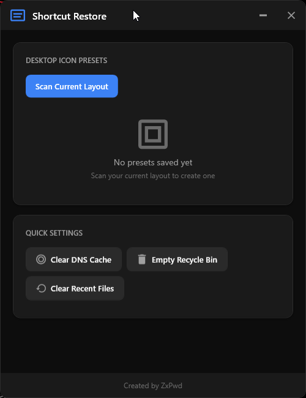

# Shortcut Restore

<div align="center">



**Save and restore your desktop icon positions with ease.**

[](https://dotnet.microsoft.com/)
[](https://docs.microsoft.com/en-us/dotnet/desktop/wpf/)
[](LICENSE)
[](https://www.microsoft.com/windows)

*Created by ZxPwd*

</div>

---

## Overview

**Shortcut Restore** is a modern Windows desktop application that allows you to save and restore the positions of your desktop icons. Ever had your desktop icons get scrambled after a display driver update, resolution change, or Windows update? This tool solves that problem by letting you save your perfectly arranged desktop layout and restore it with a single click.

## Features

### Desktop Icon Management
- **Scan Current Layout** - Instantly capture the position of all desktop icons
- **Multiple Presets** - Save unlimited layout presets (Work, Gaming, Clean, etc.)
- **One-Click Restore** - Restore any saved layout instantly
- **Rename Presets** - Edit preset names anytime with inline editing
- **Delete Presets** - Remove presets you no longer need

### Quick Settings Utilities
- **Clear DNS Cache** - Flush your DNS resolver cache (`ipconfig /flushdns`)
- **Empty Recycle Bin** - Clear all items from the Recycle Bin silently
- **Clear Recent Files** - Remove your Windows recent files history for privacy

### Modern UI
- **Custom Dark Theme** - Sleek, modern dark interface built from scratch
- **Smooth Animations** - Polished hover effects and transitions
- **Custom Window Chrome** - Borderless window with custom title bar
- **No External UI Libraries** - 100% custom XAML styling

---

## How It Works

### Technical Implementation

Shortcut Restore uses the Windows Shell API to interact with desktop icons:

1. **Icon Detection**: The application locates the desktop ListView control through the Windows window hierarchy (`Progman` → `SHELLDLL_DefView` → `SysListView32`)

2. **Position Retrieval**: Uses `LVM_GETITEMPOSITION` and `LVM_GETITEMTEXTW` messages via `SendMessage` to read icon names and coordinates

3. **Cross-Process Memory**: Since the desktop runs in Explorer's process, the app uses `VirtualAllocEx` to allocate memory in the target process for data exchange

4. **Position Restoration**: Uses `LVM_SETITEMPOSITION` to move icons back to their saved coordinates

5. **Persistent Storage**: Presets are saved as JSON in `%AppData%\ShortcutRestore\presets.json`

### Data Storage

Presets are stored in JSON format:
```json
{
  "presets": [
    {
      "id": "guid-here",
      "name": "Work Layout",
      "createdAt": "2024-01-09T10:30:00",
      "lastUsed": "2024-01-09T15:45:00",
      "icons": [
        { "name": "Chrome", "x": 100, "y": 50 },
        { "name": "Visual Studio", "x": 100, "y": 150 }
      ]
    }
  ]
}
```

---

## Installation

### Option 1: Download Release
1. Go to [Releases](https://github.com/ZxPwdz/shortcut-restore/releases)
2. Download `ShortcutRestore.zip`
3. Run the executable - no installation required!

### Option 2: Build from Source
See [Building from Source](#building-from-source) below.

---

## Usage

### Saving a Layout
1. Arrange your desktop icons exactly how you want them
2. Open Shortcut Restore
3. Click **"Scan Current Layout"**
4. Enter a name for your preset (e.g., "Work Setup")
5. Click **"Save Preset"**

### Restoring a Layout
1. Open Shortcut Restore
2. Find your saved preset in the list
3. Click **"Restore"**
4. Your icons will move to their saved positions!

### Tips
- **Disable Auto-Arrange**: For best results, right-click your desktop → View → uncheck "Auto arrange icons" and "Align icons to grid"
- **Multiple Monitors**: The app saves positions based on coordinates, so it works best when your monitor setup hasn't changed
- **Quick Settings**: Use the utility buttons at the bottom for common system tasks

---

## Building from Source

### Prerequisites
- [.NET 8.0 SDK](https://dotnet.microsoft.com/download/dotnet/8.0) or later
- Windows 10/11

### Clone and Build

```bash
# Clone the repository
git clone https://github.com/ZxPwdz/shortcut-restore.git
cd shortcut-restore

# Build for development
dotnet build ShortcutRestore.csproj

# Run the application
dotnet run --project ShortcutRestore.csproj
```

### Publishing as Single Executable

To create a standalone single-file executable that includes the .NET runtime (no .NET installation required on target machine):

```bash
dotnet publish ShortcutRestore.csproj -c Release -o publish
```

This creates a **single `ShortcutRestore.exe`** file in the `publish` folder (~65MB) that:
- Contains the entire .NET 8 runtime
- Requires no installation
- Runs on any Windows 10/11 machine
- Is fully self-contained

#### Publish Configuration

The project is configured with these publish settings in `ShortcutRestore.csproj`:

```xml
<PropertyGroup>
  <!-- Single file publish settings -->
  <PublishSingleFile>true</PublishSingleFile>
  <SelfContained>true</SelfContained>
  <RuntimeIdentifier>win-x64</RuntimeIdentifier>
  <IncludeNativeLibrariesForSelfExtract>true</IncludeNativeLibrariesForSelfExtract>
  <EnableCompressionInSingleFile>true</EnableCompressionInSingleFile>
</PropertyGroup>
```

| Setting | Description |
|---------|-------------|
| `PublishSingleFile` | Bundles all assemblies into a single executable |
| `SelfContained` | Includes the .NET runtime (no .NET required on target) |
| `RuntimeIdentifier` | Targets 64-bit Windows |
| `IncludeNativeLibrariesForSelfExtract` | Includes WPF native libraries in the bundle |
| `EnableCompressionInSingleFile` | Compresses the executable to reduce file size |

---

## Project Structure

```
ShortcutRestore/
├── App.xaml                    # Application entry and resources
├── MainWindow.xaml             # Main UI window
├── ShortcutRestore.csproj      # Project configuration
│
├── ViewModels/
│   ├── MainViewModel.cs        # Main application logic
│   └── PresetViewModel.cs      # Preset item logic
│
├── Models/
│   ├── IconPosition.cs         # Icon position data
│   ├── Preset.cs               # Preset data model
│   └── AppData.cs              # Application data container
│
├── Services/
│   ├── DesktopIconService.cs   # Desktop icon manipulation
│   ├── PresetService.cs        # JSON save/load
│   └── SystemUtilitiesService.cs # Quick settings functions
│
├── Interop/
│   └── ShellInterop.cs         # Windows API definitions
│
├── Converters/
│   └── ValueConverters.cs      # XAML value converters
│
└── Themes/
    ├── Colors.xaml             # Color palette
    ├── Fonts.xaml              # Typography
    ├── Buttons.xaml            # Button styles
    ├── TextBoxes.xaml          # Input styles
    ├── ScrollBars.xaml         # Scrollbar styles
    └── Cards.xaml              # Card panel styles
```

---

## Technologies Used

- **.NET 8.0** - Modern, cross-platform framework
- **WPF (Windows Presentation Foundation)** - Rich desktop UI framework
- **CommunityToolkit.Mvvm** - Lightweight MVVM framework
- **Windows Shell API** - Desktop icon manipulation
- **Custom XAML Themes** - No third-party UI libraries

---

## Requirements

- **OS**: Windows 10 or Windows 11
- **Architecture**: x64 (64-bit)
- **Runtime**: None required (self-contained executable)

---

## Known Limitations

- Icons must have unique names for accurate restoration
- Works best when "Auto arrange icons" is disabled
- Monitor resolution/DPI changes may affect saved positions
- Some system icons (like Recycle Bin) may have restricted positioning

---

## Contributing

Contributions are welcome! Please feel free to submit a Pull Request.

1. Fork the repository
2. Create your feature branch (`git checkout -b feature/AmazingFeature`)
3. Commit your changes (`git commit -m 'Add some AmazingFeature'`)
4. Push to the branch (`git push origin feature/AmazingFeature`)
5. Open a Pull Request

---

## License

This project is licensed under the MIT License - see the [LICENSE](LICENSE) file for details.

---

## Acknowledgments

- Icon design resources
- Microsoft WPF documentation
- The .NET community

---

<div align="center">

**Created with passion by ZxPwd**

If you find this tool useful, please consider giving it a star!

</div>
